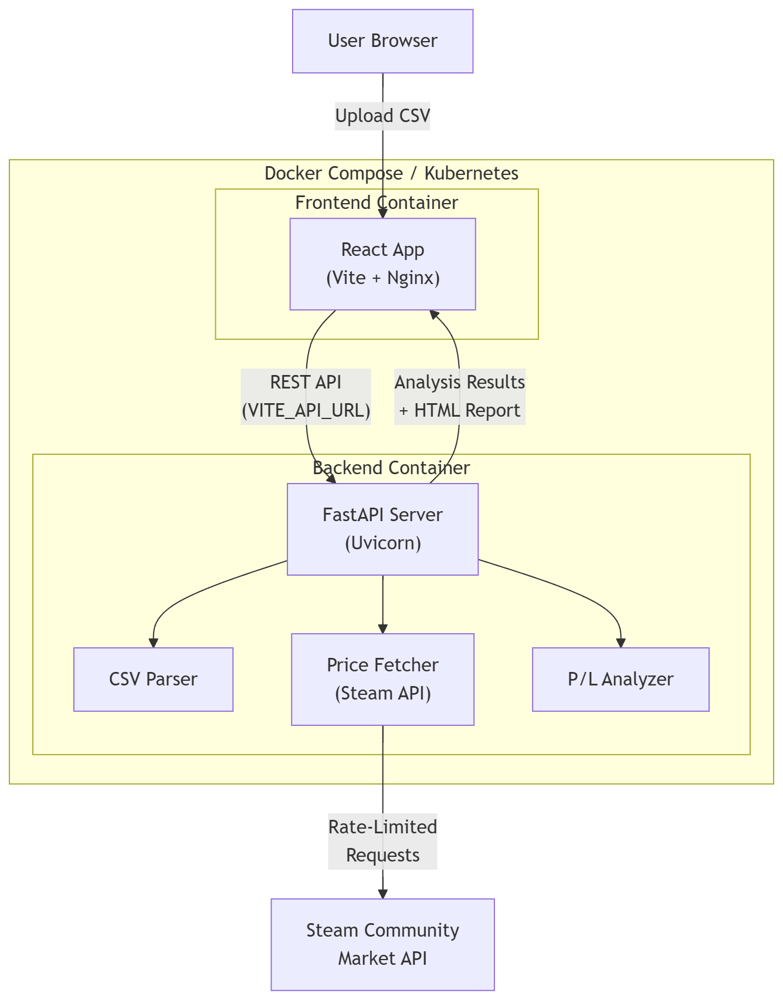
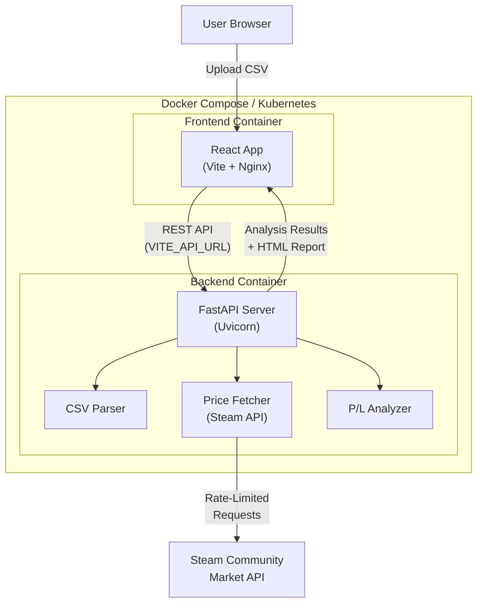

# Architecture

The application is split into two independent services, making it easy to deploy using Docker Compose or Kubernetes.

## Architecture Overview

## Frontend (React + Vite)
Served via Nginx in production. It communicates with the backend via REST API.

## Backend (FastAPI)
Handles CSV parsing, async rate-limited price fetching, and P/L calculations. Uses in-memory storage for jobs, meaning it's stateless between restarts.
